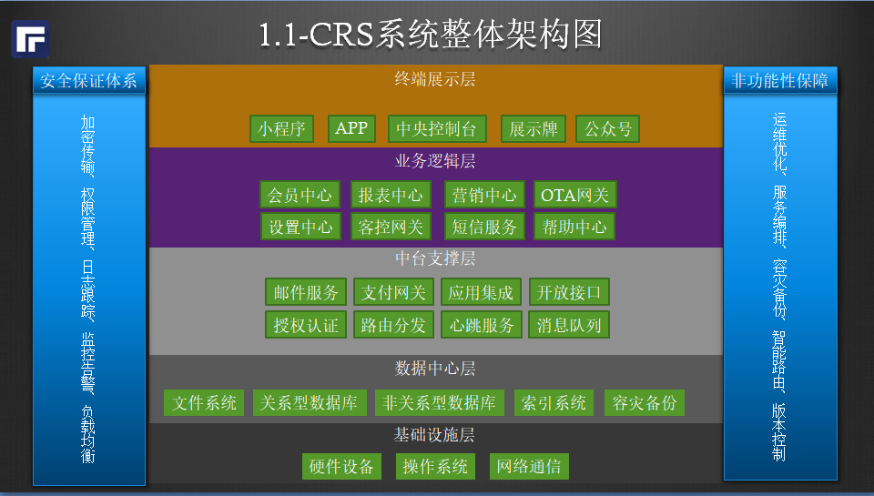
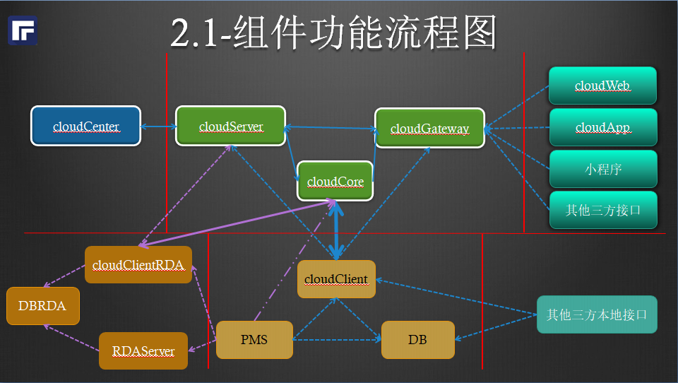

### 系统架构

#### 系统简介.

1. 基于瑞通PMS系统,提供网关接口服务.
1. 云+端部署,线上线下一体化.
1. 统一鉴权，限流，监控模型。

#### 组件部署.

1. PMS: 瑞通酒店管理系统主程序,支持本地部署和云端(公有云+私有云)部署。
1. CRS客户端: 连接PMS和CRS的中间件程序，线上线下双向连接，实时通信。
1. CRS服务端: CRS业务逻辑云端处理单元，分节点横向可扩展。
1. CRS网关端: CRS网关连接处理单元,多节点横向扩展，可在线热更新。
1. CRS网页控制台: 云端登录管理控制台。
1. 安卓APP瑞通软件：手机，POS机，自助机等安卓系统登录终端。
1. 小程序【瑞通软件】: 移动端登录管理控制台，瑞通提供运营资质，商家操作员登录使用完成相应业务。
1. 小程序【瑞通云】：客人版小程序模板，商家提供运营资质，客人使用完成相应业务。

#### 数据管理。
1. 元数据: 字典数据量小，变动频率很低，采用CRS服务端缓存模式，有变动时需手工更新。
1. 业务数据： 数据量大，变动频率高，采用指令转发的形式进行获取。
1. 报表数据: 审核后的报表数据不会改变，采用CRS服务端缓存。

#### 组件版本规范: a.b.c
1. a: 主版本号,兼容性标志，主版本号变动时，需要更新全目录。
1. b: 次版本号, 功能特性标志。
1. c: 发布日期.
