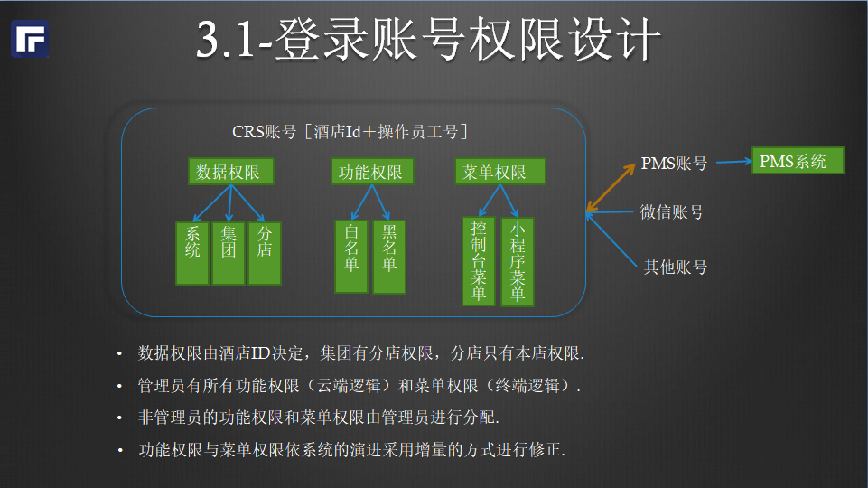

### 权限模型

#### 账号权限

1. CRS账号与PMS账号是独立的账号体系。
1. CRS账号绑定PMS账号后可拥有PMS中数据操作的权限。
1. CRS各终端登录时以CRS账号登录，CRS服务端负责鉴权。
1. 菜单权限分WEB控制台权限和移动端权限。
1. root为管理员账号，使用黑名单禁止权限，新增功能后默认拥有权限。
1. 非root为普通账号，使用白名单授权，需要管理员分配权限。

#### 功能权限。
1. kf_status: 房态修改权限。
1. kf_status_layer： 房态查看楼层限制，非空时过滤指定的楼层。
1. kf_status_yd： 客房预定，
1. kl_dcb： 康乐点菜宝，餐厅点餐。
1. kl_yd： 康乐预定，餐厅预定。

#### 移动端组织结构，扁平化菜单管理。
1. 

#### WEB控制台组织结构
1. 会员中心。
    1. 协议客户。
    1. 渠道会员。
    1. 营销活动。
1. 预定中心。
    1. 客房预定。
    1. 康乐预定。
1. 订单中心。
    1. 客房库存。
    1. 客房订单。
    1. 康乐订单。
1. 报表中心。
    1. 经营收入。
    1. 客房报表。
    1. 康乐报表。
    1. 支付流水。
    1. 高级报表。
1. 设置中心。
    1. 酒店设置。
    1. 客房数据。
    1. 客房接口。
    1. 康乐接口。
    1. 库存设置。
    1. 会场设置。
    1. 组件模块。
    1. 监控日志。
    1. 微信开放平台.
    1. 支付宝开放平台。